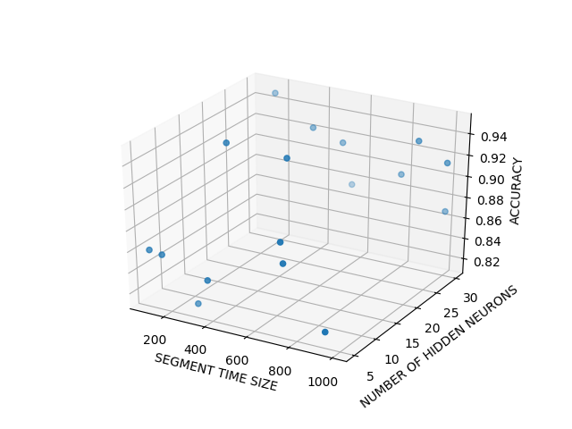

# Human Activity Recognition on the Wireless Sensor Data Mining (WISDM) dataset using Bidirectional LSTM Recurrent Neural Networks
This repository cotains code used to recognize human activity based on the Wireless Sensor Data Mining (WISDM) dataset using LSTM (Long short-term memory) and is heavily based on the article by [Venelin Valkov](https://medium.com/@curiousily/human-activity-recognition-using-lstms-on-android-tensorflow-for-hackers-part-vi-492da5adef64).

It extends [my previous project](https://github.com/bartkowiaktomasz/HAR-WISDM-LSTM-RNNs), by allowing for a bidirectional coomunication between network cells.

## Dataset
The data used for classification is provided by the Wireless Sensor Data Mining (WISDM) Lab and can be downloaded  [here](http://www.cis.fordham.edu/wisdm/dataset.php).
It consists of _1,098,207_ examples of various physical activities (sampled at _20Hz_) with _6_ attributes:
`user,activity,timestamp,x-acceleration,y-acceleration,z-acceleration`, and the _activities_ include: `Walking, Jogging, Upstairs, Downstairs, Sitting, Standing`. 

Original research done on this dataset can be found [here](http://www.cis.fordham.edu/wisdm/public_files/sensorKDD-2010.pdf).

## Input/Output/Background on LSTMs
Check [here](https://github.com/bartkowiaktomasz/HAR-WISDM-LSTM-RNNs).

## Results
In contrary to the previous project, a Bayesiyan Optimization was run to optimize the hyperparameters of the Network. The hyperparameters are:
_SEGMENT TIME SIZE, NUMBER OF HIDDEN NEURONS, BATCH SIZE_. There was not any apparent correlation between the variables (see below).

The maximum accuracy of _95%_ has been achieved with _*SEGMENT TIME SIZE = 200, NUMBER OF HIDDEN NEURONS = 30, BATCH SIZE = 10*_.

### Dependencies
- matplotlib 1.5.3
- seaborn 0.8.1
- numpy 1.14
- pandas 0.20.3
- scikit-learn 0.19.1
- tensorflow 1.5.0

### Use
1. Run the script with  `python3 HAR_Recognition.py`
